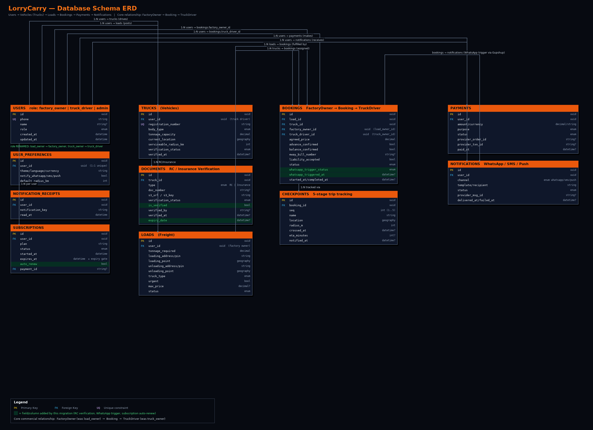

# LorryCarry — Database Schema Design

**Scope:** Normalized relational schema for Users, Vehicles (Trucks), Loads, Bookings, Payments, and
Notifications, with the commercial relationship chain **FactoryOwner → Booking → TruckDriver**, explicit
RC (Registration Certificate) verification tracking, WhatsApp notification trigger status, and
subscription expiry management.

**Engine:** PostgreSQL 15 + PostGIS 3.4, modeled with Prisma ORM 5.
**Source of truth:** [`packages/database/prisma/schema.prisma`](../packages/database/prisma/schema.prisma)
**Migrations:** [`packages/database/prisma/migrations/`](../packages/database/prisma/migrations/)
**ERD:** [`database-schema-erd.png`](./database-schema-erd.png)

---

## 1. Entity-Relationship Diagram



Fields highlighted in green were added by the
[`20260903000000_rename_roles_and_add_rc_whatsapp_subscription_fields`](../packages/database/prisma/migrations/20260903000000_rename_roles_and_add_rc_whatsapp_subscription_fields/migration.sql)
migration described in §5.

---

## 2. Role Model: FactoryOwner → Booking → TruckDriver

LorryCarry is a two-sided marketplace. The `UserRole` enum defines the two transacting roles plus an
operator role:

```prisma
enum UserRole {
  factory_owner   // posts freight Loads (cargo owners / shippers / traders / factories)
  truck_driver    // owns/drives Trucks and fulfils Loads (owner-operator model)
  admin           // KYC verification, dispute resolution, platform oversight
}
```

> **Terminology note:** the platform uses an **owner-operator** model — the account that registers a
> truck is the same account that drives/dispatches it, so `truck_driver` doubles as "truck owner." If a
> future requirement needs a fleet operator to manage *hired* drivers who don't hold their own login,
> introduce a separate `Driver` entity (id, name, licenseNumber, phone, `truckId` FK) linked 1\:N from
> `Truck`, without touching the `User`/`UserRole` model.

**Relationship chain**

```
User(role=factory_owner) ──┐
                            ├──> Booking ──> User(role=truck_driver)
Truck ──────────────────────┘        │
Load ────────────────────────────────┘
```

A `Booking` is the join entity that binds a `Load` (posted by a `factory_owner`) to a `Truck` (owned by a
`truck_driver`), while *also* directly foreign-keying both `User` rows for fast authorization checks
(`WHERE factoryOwnerId = :userId OR truckDriverId = :userId`) without having to traverse through `Load`
or `Truck`.

```prisma
model Booking {
  loadId          String
  truckId         String
  factoryOwnerId  String   @map("load_owner_id")   // FK -> users.id
  truckDriverId   String   @map("truck_owner_id")  // FK -> users.id

  load        Load  @relation(fields: [loadId], references: [id])
  truck       Truck @relation(fields: [truckId], references: [id])
  factoryOwner User @relation("FactoryOwnerBookings", fields: [factoryOwnerId], references: [id])
  truckDriver  User @relation("TruckDriverBookings",  fields: [truckDriverId],  references: [id])
}
```

Both `factoryOwnerId` and `truckDriverId` are indexed independently so a user's booking history query
(as either party) hits an index regardless of role.

---

## 3. Table-by-Table Reference

### 3.1 `users` — Users
Root identity table for OTP-based (WhatsApp/SMS) phone login. One row per account, one `role`.

| Column | Type | Notes |
|---|---|---|
| `id` | uuid PK | |
| `phone` | text, **unique** | E.164 phone number; the OTP login identity |
| `name` | text, nullable | |
| `role` | enum `UserRole` | `factory_owner` \| `truck_driver` \| `admin` |
| `created_at` / `updated_at` | timestamp | |

Indexes: `phone`, `role`.

Related 1:1/1\:N tables: `user_preferences` (1:1, notification opt-ins, search defaults),
`notification_receipts` (1\:N, read-state for the in-app notification feed).

### 3.2 `trucks` — Vehicles
A vehicle registered by a `truck_driver`.

| Column | Type | Notes |
|---|---|---|
| `id` | uuid PK | |
| `user_id` | uuid FK → `users.id` | owning/driving account |
| `registration_number` | text, **unique** | vehicle RC plate number |
| `body_type` | enum `TruckType` | `Open` \| `Container` \| `Open body` |
| `length_ft` / `height_ft` / `tonnage_capacity` | int / int / decimal(10,2) | |
| `current_lat` / `current_lng` / `current_location` | decimal / decimal / `geography(Point,4326)` | PostGIS point kept in sync with lat/lng for radius search |
| `serviceable_radius_km` | int, default 50 | |
| `preferred_destinations` | json | array of city names, used for return-load matching |
| `verification_status` | enum `VerificationStatus` | `Pending` \| `Verified` \| `Rejected` — **fleet-level** KYC gate |
| `verified_at` | timestamp, nullable | |

Indexes: `user_id`, `verification_status`, `body_type`, `tonnage_capacity`.

### 3.3 `documents` — RC / Insurance Verification (KYC)
One row per uploaded KYC document (Registration Certificate or Insurance policy), scoped to a `Truck`.
This is where **document-level** RC verification lives, distinct from the truck's aggregate
`verification_status`.

| Column | Type | Notes |
|---|---|---|
| `id` | uuid PK | |
| `truck_id` | uuid FK → `trucks.id`, `ON DELETE CASCADE` | |
| `type` | enum `DocumentType` | `RC` \| `Insurance` |
| `doc_number` | text, nullable | RC registration number / insurance policy number |
| `s3_url` / `s3_key` | text | private S3/MinIO object storing the scanned document |
| `original_filename` / `file_size` / `mime_type` | text / int / text | upload metadata |
| `verification_status` | enum `VerificationStatus` | `Pending` \| `Verified` \| `Rejected` — set by admin review |
| **`is_verified`** ★ | boolean, default `false` | denormalized `verification_status === 'Verified'` flag for cheap filtering/badges, kept in lockstep by the verification endpoint |
| `verified_by` | text, nullable | admin user id who actioned it |
| `verification_notes` | text, nullable | rejection reason / reviewer note |
| `verified_at` | timestamp, nullable | |
| **`expiry_date`** ★ | timestamp, nullable | RC fitness-certificate expiry or insurance policy expiry, whichever `type` applies to |

Indexes: `truck_id`, `type`, `verification_status`, **`expiry_date`** ★ (for the "documents expiring
soon" admin/ops query).

> **RC verification flow:** `truck_driver` uploads → `documents.verification_status = Pending` →
> `POST /admin/documents/:id/verify` sets `verification_status`, `is_verified`, `verified_by`,
> `verified_at` → once *all* of a truck's required documents are `Verified`, the API promotes
> `trucks.verification_status` to `Verified` as well.

### 3.4 `loads` — Freight Postings
A freight requirement posted by a `factory_owner`.

| Column | Type | Notes |
|---|---|---|
| `id` | uuid PK | |
| `user_id` | uuid FK → `users.id` | posting factory owner |
| `tonnage_required` | decimal(10,2) | |
| `loading_address` / `loading_pin` / `loading_lat` / `loading_lng` / `loading_point` | text / text / decimal / decimal / `geography(Point,4326)` | pickup location + PostGIS point |
| `unloading_address` / `unloading_pin` / `unloading_lat` / `unloading_lng` / `unloading_point` | (mirror of loading columns) | drop location |
| `truck_type` | enum `TruckType` | required body type |
| `min_length_ft` / `min_height_ft` | int, nullable | |
| `urgent` | boolean, default `false` | |
| `max_price` | decimal(12,2), nullable | shipper's budget ceiling |
| `expected_delivery_at` | timestamp, nullable | |
| `advance_payable` | decimal(12,2), nullable | proposed 50% advance amount |
| `status` | enum `LoadStatus` | `Open` \| `Matched` \| `In-transit` \| `Completed` \| `Cancelled` |

Indexes: `user_id`, `status`, `truck_type`, `urgent`, `created_at`, plus GiST spatial indexes on
`loading_point` / `unloading_point` (created via raw SQL in the migration for PostGIS radius search).

### 3.5 `bookings` — Commercial Bookings (FactoryOwner → Booking → TruckDriver)
The core transactional join entity: one `Load` fulfilled by one `Truck`, with commercial terms.

| Column | Type | Notes |
|---|---|---|
| `id` | uuid PK | |
| `load_id` | uuid FK → `loads.id` | |
| `truck_id` | uuid FK → `trucks.id` | |
| `load_owner_id` (Prisma field `factoryOwnerId`) | uuid FK → `users.id` | the factory owner party |
| `truck_owner_id` (Prisma field `truckDriverId`) | uuid FK → `users.id` | the truck driver party |
| `agreed_price` | decimal(12,2) | |
| `advance_confirmed` / `advance_confirmed_at` | boolean / timestamp | 50% advance-at-loading milestone |
| `balance_confirmed` / `balance_confirmed_at` | boolean / timestamp | 50% balance-at-delivery milestone |
| `eway_bill_number` | text, nullable | compliance |
| `liability_accepted` / `liability_accepted_at` | boolean / timestamp | terms acceptance |
| `status` | enum `BookingStatus` | `Pending` \| `Confirmed` \| `In-transit` \| `Completed` \| `Cancelled` |
| **`whatsapp_trigger_status`** ★ | enum `WhatsappTriggerStatus`, default `NotTriggered` | `NotTriggered` \| `Queued` \| `Sent` \| `Delivered` \| `Failed` — rollup of the outbound booking-confirmation WhatsApp trigger (see §4) |
| **`whatsapp_triggered_at`** ★ | timestamp, nullable | when the trigger last fired |
| `started_at` / `completed_at` | timestamp, nullable | |

Indexes: `load_id`, `truck_id`, `status`, `factory_owner_id` (Prisma: `factoryOwnerId`),
`truck_owner_id` (Prisma: `truckDriverId`), **`whatsapp_trigger_status`** ★.

Relations: `checkpoints` (1\:N, the 5-stage tracking trail).

### 3.6 `checkpoints` — 5-Stage Trip Tracking
Geofenced waypoints for a booking's journey (not live GPS — checkpoint-crossing based).

| Column | Type | Notes |
|---|---|---|
| `id` | uuid PK | |
| `booking_id` | uuid FK → `bookings.id`, `ON DELETE CASCADE` | |
| `seq` | int | 1–5, unique per booking (`@@unique([bookingId, seq])`) |
| `name` | text | e.g. "Pune", "Satara", "Belagavi" |
| `lat` / `lng` / `location` | decimal / decimal / `geography(Point,4326)` | geofence center |
| `radius_m` | int | geofence radius, default 2000m (500m at load/unload points) |
| `crossed_at` | timestamp, nullable | |
| `crossed_by` | text, nullable | device/user id that reported the crossing |
| `eta_minutes` | int, nullable | calculated ETA at creation |
| `notified_at` | timestamp, nullable | when the WhatsApp/push checkpoint alert was sent |

### 3.7 `payments` — Payments
Every money movement — subscription purchases and booking advance/balance — as one ledger row.

| Column | Type | Notes |
|---|---|---|
| `id` | uuid PK | |
| `user_id` | uuid FK → `users.id` | payer |
| `amount` | decimal(12,2) | |
| `currency` | text, default `INR` | |
| `purpose` | enum `PaymentPurpose` | `subscription` \| `booking_advance` \| `booking_balance` |
| `status` | enum `PaymentStatus` | `Pending` \| `Success` \| `Failed` \| `Refunded` |
| `provider` | text, default `cashfree` | |
| `provider_order_id` / `provider_txn_id` | text, nullable | Cashfree order/transaction refs |
| `payment_method` | text, nullable | UPI / CARD / etc. |
| `paid_at` | timestamp, nullable | |
| `failure_reason` | text, nullable | |
| `metadata` | json, nullable | |

### 3.8 `subscriptions` — Subscription / Paywall
Gates transporter contact-reveal and other paid features. **Expiry-driven**, not seat-driven.

| Column | Type | Notes |
|---|---|---|
| `id` | uuid PK | |
| `user_id` | uuid FK → `users.id` | |
| `plan` | text | e.g. `monthly_unlimited`, `pay_per_unlock` |
| `status` | enum `SubscriptionStatus` | `active` \| `expired` \| `cancelled` |
| `started_at` | timestamp | |
| **`expires_at`** | timestamp | **the subscription-expiry gate** — the paywall middleware checks `now() < expiresAt` (in addition to `status === 'active'`) before unlocking contact reveal / booking creation |
| **`auto_renew`** ★ | boolean, default `false` | whether Cashfree should attempt an automatic renewal charge as `expiresAt` approaches |
| `payment_id` | text, nullable | linked `payments.id` |

Indexes: `user_id`, `status`, **`expires_at`** ★ (for the "subscriptions expiring in N days" reminder job
and admin dashboard).

### 3.9 `notifications` — Outbound Message Log
Per-recipient log of every WhatsApp/SMS/push message actually sent (granular — one row per message).

| Column | Type | Notes |
|---|---|---|
| `id` | uuid PK | |
| `user_id` | uuid FK → `users.id` | |
| `channel` | enum `NotificationChannel` | `whatsapp` \| `sms` \| `push` |
| `template` | text | template name/code, e.g. `booking_confirmed_driver` |
| `variables` | json, nullable | template variables |
| `recipient` | text | phone number or device token |
| `content` | text, nullable | rendered content actually sent |
| `status` | enum `NotificationStatus` | `Pending` \| `Sent` \| `Delivered` \| `Failed` |
| `provider` | text, default `gupshup` | or `msg91` |
| `provider_msg_id` | text, nullable | |
| `delivered_at` / `failed_at` / `failure_reason` | timestamp / timestamp / text | |

Related: `notification_receipts` (per-user read state — covers both persisted `Notification` rows and
notifications derived at request time, e.g. "KYC pending" banners, via an opaque `notification_key`).

---

## 4. WhatsApp Trigger Status — Design Rationale

There are two levels of "did the WhatsApp message go out" tracking, intentionally kept separate:

1. **`notifications` table** — the granular, per-recipient audit log. Every individual WhatsApp/SMS/push
   send (OTP, booking confirmation, checkpoint alert, KYC status) gets its own row here with full
   provider metadata (`provider_msg_id`, `delivered_at`, `failure_reason`, …). This is the system of
   record for compliance/debugging.
2. **`bookings.whatsapp_trigger_status` / `whatsapp_triggered_at`** ★ — a denormalized rollup on the
   `Booking` itself, updated when `sendBookingNotifications()` fires the paired
   `booking_confirmed_driver` / `booking_confirmed_shipper` messages. This lets the booking detail screen
   show a single "WhatsApp sent ✓ / pending / failed" indicator without joining `notifications` and
   aggregating two rows (one per party) every time the booking is rendered.

```prisma
enum WhatsappTriggerStatus {
  NotTriggered
  Queued
  Sent
  Delivered
  Failed
}
```

State machine: `NotTriggered → Queued → Sent → Delivered` (happy path), or `→ Failed` if the Gupshup API
call errors — in which case the booking action-center surfaces a retry action.

---

## 5. Migration: Role Rename + New Fields

File: [`packages/database/prisma/migrations/20260903000000_rename_roles_and_add_rc_whatsapp_subscription_fields/migration.sql`](../packages/database/prisma/migrations/20260903000000_rename_roles_and_add_rc_whatsapp_subscription_fields/migration.sql)

| Change | Mechanism | Backward compatible? |
|---|---|---|
| `UserRole` enum: `load_owner` → `factory_owner`, `truck_owner` → `truck_driver` | `ALTER TYPE ... RENAME VALUE` (metadata-only, no row rewrite) | ✅ every existing `users.role` value keeps pointing at the same logical role |
| `documents.is_verified`, `documents.expiry_date` | `ALTER TABLE ... ADD COLUMN` with default/nullable | ✅ additive; `is_verified` backfilled from existing `verification_status = 'Verified'` rows |
| `subscriptions.auto_renew` | `ALTER TABLE ... ADD COLUMN ... DEFAULT false` | ✅ additive |
| `bookings.whatsapp_trigger_status`, `bookings.whatsapp_triggered_at` | new enum + `ALTER TABLE ... ADD COLUMN` | ✅ additive |
| New indexes: `documents.expiry_date`, `subscriptions.expires_at`, `bookings.whatsapp_trigger_status` | `CREATE INDEX` | ✅ no lock beyond a standard index build |

`bookings.load_owner_id` / `bookings.truck_owner_id` **column names are unchanged** — only the Prisma
model field names became `factoryOwnerId` / `truckDriverId` (via `@map`), so no data migration or FK
rebuild was needed for that rename.

Application code across `apps/api`, `apps/web`, `apps/admin`, and `apps/mobile` was updated in the same
change to use the new role names and dashboard routes (`/dashboard/factory-owner`,
`/dashboard/truck-driver`) end-to-end.

### 5.1 Follow-up: dropping the legacy enum values

File: [`packages/database/prisma/migrations/20260904000000_canonicalize_user_roles/migration.sql`](../packages/database/prisma/migrations/20260904000000_canonicalize_user_roles/migration.sql)

The rename above left a short-lived `driver` value in the enum (added by
`20260903000000_add_driver_role_and_trial_subscription`) for an individual-driver persona. The
owner-operator model makes that persona identical to `truck_driver`, so the follow-up migration
canonicalizes the enum to exactly `factory_owner | truck_driver | admin`.

| Change | Mechanism | Backward compatible? |
|---|---|---|
| `users.role = 'driver'` → `'truck_driver'` | `UPDATE` **before** the value is dropped | ✅ no row is left pointing at a removed value |
| Drop `driver` (and any surviving `load_owner` / `truck_owner`) from `UserRole` | Postgres has no `DROP VALUE`: create `UserRole_new`, cast the column via `TEXT` with a `CASE` remap, `DROP TYPE`, `RENAME` | ✅ the `CASE` remap makes the migration safe even on a database that skipped the rename migration |

Role labels still in flight — cached cookies, unexpired JWTs, older mobile bundles — keep working:
every entry point normalizes them before use.

| Layer | Normalizer |
|---|---|
| API | `apps/api/src/common/utils/roles.util.ts` (`normalizeRole`), applied in `RolesGuard`, `AuthService.verifyOtp`, `VerifyOtpDto`, and `AdminService.listUsers` |
| Web | `apps/web/src/lib/roles.ts` (`normalizeRole`, `getDashboardForRole`), applied in `middleware.ts` and the dashboard components |
| Mobile | `apps/mobile/src/lib/roles.ts` |
| Shared | `packages/shared/src/types` (`normalizeUserRole`, `LEGACY_ROLE_MAP`) |

Legacy dashboard routes remain mounted as pure redirects: `/dashboard/load-owner` →
`/dashboard/factory-owner`, and `/dashboard/truck-owner` and `/dashboard/driver` →
`/dashboard/truck-driver`.

---

## 6. Normalization Notes

The schema is in **3NF**:

- Every non-key column depends on the whole primary key, not a part of it (all PKs are single-column
  UUIDs, so partial-dependency violations are structurally impossible).
- No transitive dependencies: e.g. `documents.verification_status` describes the *document*, not the
  `truck` it belongs to — the truck's own aggregate `verification_status` is a separately maintained
  column on `trucks`, not derived by a query-time join that would otherwise justify storing it twice.
- Repeating groups are extracted into child tables: `checkpoints` (1\:N per booking) instead of five
  `checkpoint_N_lat` columns on `bookings`; `documents` (1\:N per truck) instead of `rc_url`/`insurance_url`
  columns on `trucks`.
- The two deliberate denormalizations — `documents.is_verified` and `bookings.whatsapp_trigger_status`
  — are documented, narrow, single-purpose read-optimizations kept in sync by the write path that owns
  them (never written to independently), not uncontrolled duplication.

---

## 7. Key Relationships Summary

| Relationship | Cardinality | FK column | Cascade |
|---|---|---|---|
| User (factory_owner) → Load | 1\:N | `loads.user_id` | `ON DELETE CASCADE` |
| User (truck_driver) → Truck | 1\:N | `trucks.user_id` | `ON DELETE CASCADE` |
| Truck → Document | 1\:N | `documents.truck_id` | `ON DELETE CASCADE` |
| Load → Booking | 1\:N | `bookings.load_id` | `ON DELETE RESTRICT` |
| Truck → Booking | 1\:N | `bookings.truck_id` | `ON DELETE RESTRICT` |
| **User (factory_owner) → Booking** | **1\:N** | `bookings.load_owner_id` | `ON DELETE RESTRICT` |
| **User (truck_driver) → Booking** | **1\:N** | `bookings.truck_owner_id` | `ON DELETE RESTRICT` |
| Booking → Checkpoint | 1\:N | `checkpoints.booking_id` | `ON DELETE CASCADE` |
| User → Subscription | 1\:N | `subscriptions.user_id` | `ON DELETE CASCADE` |
| User → Payment | 1\:N | `payments.user_id` | `ON DELETE CASCADE` |
| User → Notification | 1\:N | `notifications.user_id` | `ON DELETE CASCADE` |
| User → UserPreference | **1:1** | `user_preferences.user_id` (unique) | `ON DELETE CASCADE` |

Bookings intentionally use `RESTRICT` (not `CASCADE`) on `load_id`/`truck_id`/party FKs — a `Load`,
`Truck`, or `User` with existing bookings cannot be hard-deleted, preserving financial/audit history.

---

## 8. Regenerating the ERD

The diagram is generated offline with Pillow (no external network/binary dependency) from
[`scripts/render_erd.py`](../scripts/render_erd.py):

```bash
python3 scripts/render_erd.py   # writes docs/database-schema-erd.png
```
